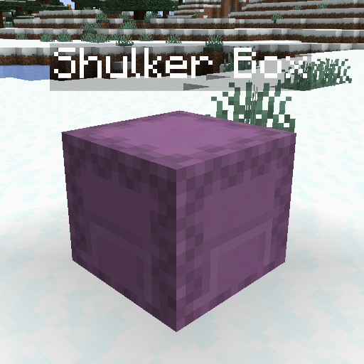

# Labeled Shulkers

A serverside mod that adds nametag-style labels on top of shulker boxes when the player looks at them.

## Features
- Fake entities 
  - The labels can only be seen by a single player and don't cause lag on the server
- Holograms
  - Make shulker boxes always display their name when placed by turning them into holograms! 
    `/set_hologram`-> Sets the shulker box you're holding as a hologram 
    `/unset_hologram`-> Unsets the shulker box you're holding as a hologram
- Configurable
  - Just edit the `config/labeledshulkers.toml` file!